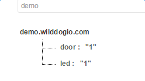

# demo-c-liveshell-raspberry-IOT
采用野狗liveshell开发的在树莓派上实现智能家居的案例。

本用例采用[liveshell](`https://github.com/WildDogTeam/liveshell`)（https://github.com/WildDogTeam/liveshell）以及python制作，实现一个房屋模型的大门以及led灯的开关。

##使用说明

使用的工具及代码：

1. liveshell：和云端同步数据，并将最新的数据（JSON字符串形式）作为参数传递给python脚本；
2. src/smartHome-raspberry.py：实际控制门和灯的python脚本。

####配置

##### liveshell以及云端配置

1. 下载并安装liveshell（参见liveshell项目的readme）；
2. 在野狗网站中建立一个app，并建立云端数据树来控制门和灯。其中，led节点的值代表灯的状态；door节点的值代表门的状态。0代表关，1代表开；

##### python脚本配置

在smartHome-raspberry.py中，根据自己需要，设置以下值：

	ledGpio：控制灯的gpio口（BCM模型下的gpio编号）
	doorGpio：控制门的gpio口（BCM模型下的gpio编号）
	doorOpenValue：门开的电机角度值
	doorCloseValue：门关的电机角度值

##### 硬件配置

需要材料：树莓派一台、led灯一个、直流电机一个、杜邦线若干。

按照gpio的配置将树莓派和电机、led灯连接。

####使用

1. 将smartHome-raspberry.py拷贝到树莓派下，并设置可执行权限

		cp smartHome-raspberry.py ~
		cd ~
		sudo chmod +x smartHome-raspberry.py
2. 运行liveshell（上图中appid为demo）
		
		liveshell coap://你的appid.wilddogio.com smartHome-raspberry.py
3. 更改云端门或者灯的值，即可看见灯和门的变化。